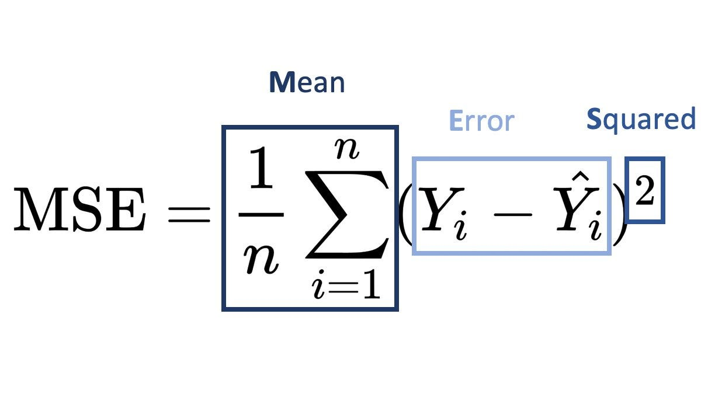
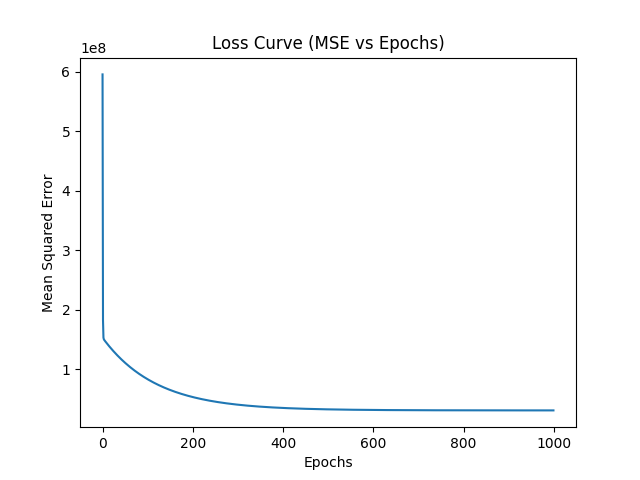

**# Linear Regression model from scratch.**

**-----------------------------------------**

In this project I tried to implement Linear regression using Gradient Descent,

without using the known libraries for it.The goal was to challenge myself to understand and

implement the math behind it.

**-----------------------------------------**

The main ideas in this project :

-Gradient descent optimization

-Mean squared error(MSE)

-Linear Regression equation (y=mx+b)

**-----------------------------------------**

The dataset I used was imported from Kaggle:

https://www.kaggle.com/datasets/abhishek14398/salary-dataset-simple-linear-regression

the data features salary vs experience (in years)

**-----------------------------------------**

**So what is Linear regression exactly ?**

Linear regression is a line that "*tries*" to find the relationship between things

and predict the future outcomes.

like for example the relationship between hours studied for an exam

and the marks for that exam using this equation (y=mx+b)

where in this example:

x: the hours studied

y:The mark obtained

m:the slope

b:the intercept (Basically means the outcome in the first state, when x=0)

**And what is Gradient Descent?**

Gradient descent is an algorithm that minimizes the cost function (a function that measures the difference between actual and predicted results

to get that difference we need to calculate **MSE or Mean squared Error** which is the average squared difference between the estimated

and true values

using this equation:

**-----------------------------------------**

**Plots**

**-----------------------------------------**

**-----------------------------------------**

